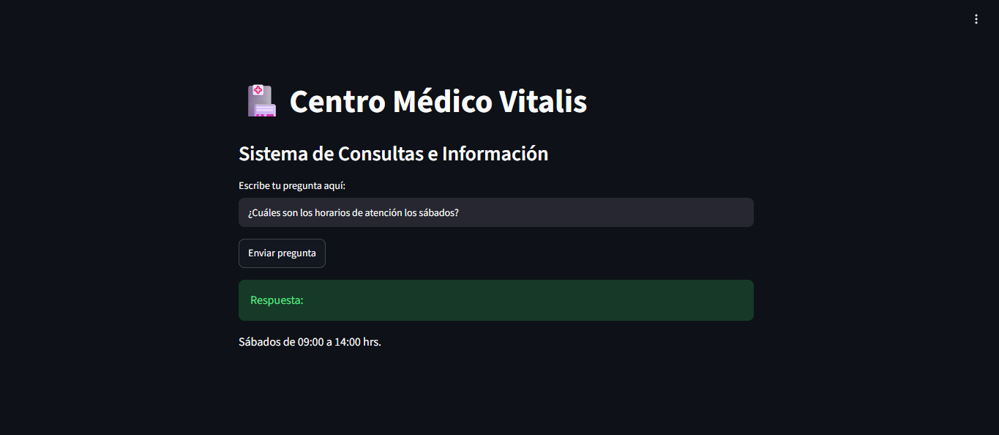
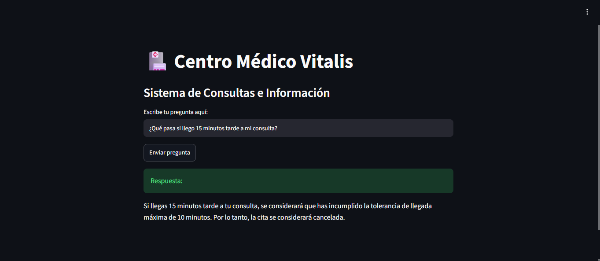
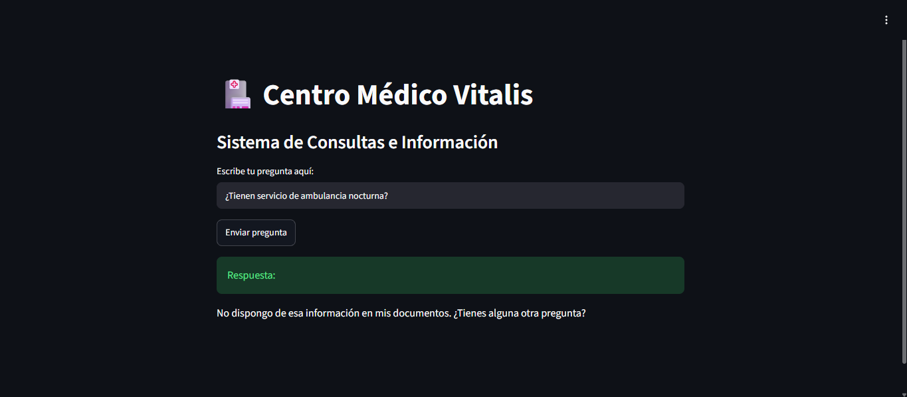
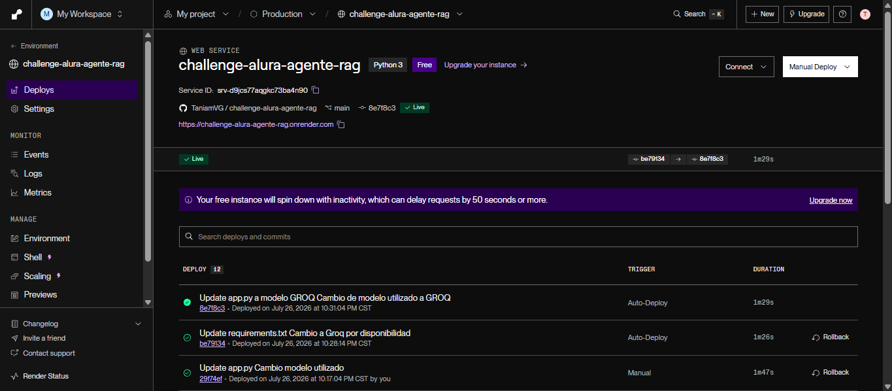

# 🏥 Agente RAG - Centro Médico Vitalis

Un agente conversacional inteligente basado en **RAG (Retrieval-Augmented Generation)** diseñado para resolver dudas y consultas de pacientes del **Centro Médico Vitalis**, garantizando respuestas deterministas y libre de alucinaciones.

---

## Tecnologías y Herramientas

* **Lenguaje:** Python 3.10+
* **Procesamiento de Documentos:** `LangChain` & `PyPDF`
* **Generación del Documento Base:** `ReportLab`
* **LLM Engine & Inferencia:** `Groq API` (`llama-3.1-8b-instant`)
* **Interfaz de Usuario:** `Streamlit`
* **Despliegue & Hosting Cloud:** `Render`

---

## Arquitectura del Sistema

1. **Generación del Conocimiento:** Se crea dinámicamente un documento PDF estructurado (`consultorio_medico.pdf`) con las políticas, horarios y reglamentos oficiales de la clínica.
2. **Procesamiento de Texto:** Mediante `PyPDFLoader` y `RecursiveCharacterTextSplitter`, el documento se fragmenta en bloques (*chunks*) para su análisis.
3. **Inferencia Determinista (Zero-Hallucination):** El modelo `llama-3.1-8b-instant` procesa el contexto delimitado y aplica una regla estricta: si la información no está explícita en el documento, responde únicamente con la plantilla de abstención predeterminada.
4. **Interfaz Interactiva:** Una app web en `Streamlit` que permite a los usuarios hacer preguntas en tiempo real.

---

## Preguntas Frecuentes y Capacidades

### Ejemplos de preguntas que el agente puede responder:
*(Consultas respaldadas por la información oficial del documento del Centro Médico Vitalis)*

* **Horarios y Turnos:**
  * ¿Cuáles son los horarios de atención los sábados?
  * ¿Cómo puedo agendar una cita médica?
  * ¿Con cuánta anticipación debo llegar a mi consulta?

* **Políticas de Cancelación y Tolerancia:**
  * ¿Qué pasa si llego 15 minutos tarde a mi consulta?
  * ¿Cuál es el costo por cancelar una cita con menos de 24 horas de anticipación?
  * ¿Existe algún cargo por reagendar mi turno con tiempo?

* **Aseguradoras y Coberturas:**
  * ¿Qué seguros o coberturas médicas aceptan?
  * ¿Cómo funciona el trámite de reembolso si pago de forma particular?

* **Indicaciones Médicas y Privacidad:**
  * ¿Cuántas horas de ayuno se requieren para un análisis de sangre?
  * ¿Qué preparación necesito para un ultrasonido abdominal?
  * ¿Cuánto tiempo de vigencia tienen las recetas médicas?
  * ¿Cómo garantizan la privacidad de mi expediente clínico?

---

## Despliegue en la Nube (Deploy con Render)

> **Nota sobre la infraestructura:** Inicialmente se consideró el despliegue en **Oracle Cloud Infrastructure (OCI)**; sin embargo, debido a la falta de disponibilidad de instancias de cómputo en la capa gratuita (*Out of capacity*), se optó por **Render** como plataforma de PaaS por su alta disponibilidad, despliegue continuo desde GitHub y rendimiento óptimo con arquitecturas basadas en APIs.

### 🌐 Enlace de la Aplicación en Vivo:
**[Ver Agente RAG en Render](https://challenge-alura-agente-rag.onrender.com)**

---

## Evidencia de Ejecución y Pruebas del Agente

A continuación se presentan las capturas del agente funcionando en producción a través del enlace público de **Render**:

### 1. Respuestas a Consultas Oficiales

*Prueba 1: Consulta sobre horarios de atención los sábados.*

*Prueba 2: Consulta sobre la política de tolerancia y retrasos en citas.*

### 2. Control de Alucinaciones (Información No Disponible)

*Prueba 3: Demostración del comportamiento de seguridad al preguntar por servicios no incluidos en el PDF (ej. ¿Tienen servicio de ambulancia nocturna?).*

### 3. Estado del Servicio en Producción (Render)

*Panel de Render confirmando la compilación exitosa y el estado activo del servicio (`Status: Live`).*
